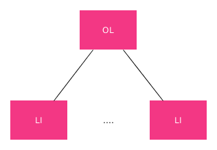
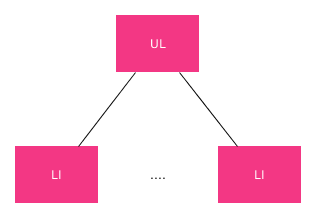
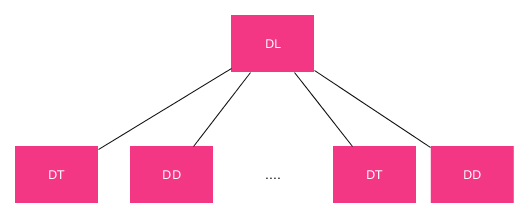

Las listas son una de las construcciones más usadas a la hora de elaborar textos, no sólo en HTML. No obstante, en HTML están también presentes y pueden ser de 3 tipos:

- **Listas Numeradas:** que son aquellas que expresan un orden enre los diferentes elementos de la lista. Este orden podrá ser numérico, alfabético etc..
- **Listas no numeradas:** que simplemente muestra los elementos de la lista uno tras otro.
- **Listas de definición:** que muestran diversos términos junto con su definición.

A continuación vamos a ver el árbol DOM para cada una de esta variedades:

###Lista Numeradas



Un ejemplo:

```html
    <!-- Listas numeradas -->
    <h3>Lista Numerada - Ordered List (ol)</h3>
    <ol>
        <li>Primer elemento</li>
        <li>Segundo elemento</li>
        <li>Tercer Elemento</li>
        <li>Cuarto elemento</li>
    </ol>
```

**ol** sería la etiqueta padre y cada uno de los elemento de la lista iría en una etiqueta **li**.

###Listas no Numeradas



Un ejemplo:

```html
    <!-- Listas no numeradas-->
    <h3>Lista NO Numerada - Unordered List (ul)</h3>
    <ul>
        <li>Primer elemento</li>
        <li>Segundo elemento</li>
        <li>Tercer Elemento</li>
        <li>Cuarto elemento</li>
    </ul>
```

**ul** sería la etiqueta padre y cada uno de los elemento de la lista iría en una etiqueta **li**.

###Listas de definición



Un ejemplo:

```html
    <!-- Listas de definición-->
    <h3> Lista de descripción - Description List (dl)</h3>
    <dl>
        <dt>Primer término</dt>
        <dd>Definición del primer término</dd>
        <dt>Segundo término</dt>
        <dd>Definición del segundo término</dd>
        <dt>Tercer término</dt>
        <dd>Definición del tercer término</dd>
        <dt>Cuarto término</dt>
        <dd>Definición del cuarto término</dd>
    </dl>
```

**Dl** sería la etiqueta padre y cada término se define mostrando consecutivamente las etiquetas **dt**, que se corresponde con el término que vamos a definir, y **dd** que es la definición del término anterior.
