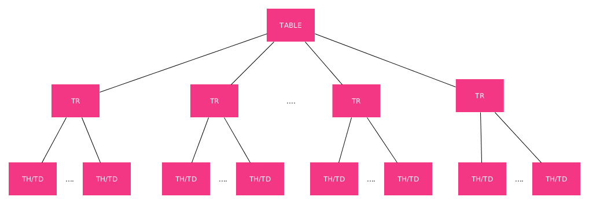
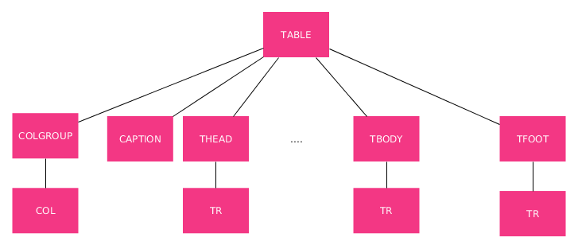

## Tablas en HTML

Otras de las construcciones básicas en HTML son las tablas.

Además de para la presentación de elementos se usaron históricamente para dar estructura a las páginas. No obstante, por motivos que explicaremos en el próximo curso de este itinerario, ya no se maqueta con tablas.

A pesar de eso siguen siendo un elemento importante y a continuación vamos a presentar varias formas de hacer tablas.

### Tablas Simples

La estructura del árbol DOM más simple para una tabla sería similar a la siguiente:

- Una etiqueta **`<table>`** que contiene toda la tabla.
- Como hijos directos, tantas etiquetas **<tr>** como fijas queramos que tenga nuestra tabla.
- Dentro de cada filas tantas celdas (**<td>** o **<th>**) como queramos que tengan nuestras filas.La única diferencia entre estas dos es que el contenido en la segunda se presenta centrado y el texto en negrita.

**NOTA:** Si no coinciden el número de celdas en todas las filas veremos que sucecen cosas "extrañas".

**NOTA:** La anchura de las celdas de una misma columna será la anchura de la más ancha de la columna.

**NOTA:** La altura de las celdas de una misma fija será la altura de la más alta de la fila.



Un ejemplo sería:

```html
    <table>
        <tr>
            <th>Nombre</th>
            <th>Apellidos</th>
            <th>Dirección</th>
        </tr>
        <tr>
            <td>Pepe</td>
            <td>Pérez</td>
            <td>Aquí</td>
        </tr>
        <tr>
            <td>Manuel</td>
            <td>López</td>
            <td>Allí</td>
        </tr>
        <tr>
            <td>María</td>
            <td>Fernández</td>
            <td>Mas allá</td>
        </tr>
        <tr>
            <td>Sara</td>
            <td>Gallardo</td>
            <td>Mas aquí</td>
        </tr>

    </table>
```

### Tablas Completas

Existe además una forma más precisa y completa de construir tablas. Una forma que puede contener (aunque no es obligatorio) otras etiquetas dentro de la etiqueta raíz **`<table>`**. Estas nuevas etiquetas pueden ser:

- **`<colgroup>`** que nos permite agrupar los columnas para darles estilos. Cada uno de esos grupos lo definiremos usando una etiqueta **<col>** con un atributo **span** para definir el número de columnas de cada grupo.
- **`<caption>`** para añadir un título o leyenda a la tabla en la parte superior.
- **`<thead>`** que contendrá la fila (usualmente) o filas que sean la cabecera de una tabla.
- **`<tbody>`** que es donde pondremos las filas que son el contenido propiamente dicho de la tabla, el cuerpo.
- **`<tfoot>`** que es donde pondremos las filas que son el pie de nuestra tabla.



Un ejemplo sería:

```html
<table>
        <colgroup>
            <col span="3" style="background-color: grey">
            <col style="background-color: yellow">
            <col style="background-color: green">
        </colgroup>
        <caption>Alumnos matriculados</caption>
        <thead>
            <tr>
                <th>Nombre</th>
                <th>Apellidos</th>
                <th>Dirección</th>
                <th>Teléfono</th>
                <th>Email</th>
            </tr>
        </thead>
        <tbody>
            <tr>
                <td>Pepe</td>
                <td>Pérez</td>
                <td>Aquí</td>
                <td>11111111</td>
                <td>yosoy@pepe.es</td>
            </tr>
            <tr>
                <td>Manuel</td>
                <td>López</td>
                <td>Allí</td>
                <td>222222222</td>
                <td>yosoy@manuel.es</td>
            </tr>
            <tr>
                <td>María</td>
                <td>Fernández</td>
                <td>Mas allá</td>
                <td>33333333</td>
                <td>yosoy@maria.es</td>
            </tr>
            <tr>
                <td>Sara</td>
                <td>Gallardo</td>
                <td>Mas aquí</td>
                <td>44444444</td>
                <td>yosoy@sara.es</td>
            </tr>
        </tbody>
        <tfoot>
            <tr>
                <td>Pie de la tabla donde pongo más texto para que se vea como crecen</td>
            </tr>
        </tfoot>
    </table>
```

### Tablas Complejas

Con todo lo explicado anteriormente podemos ver que las tablas que conseguimos son relativamente sencillas. En la vida real, nos encontraremos con estructuras tabulares más complejas. Éstas también se pueden construir en HTML utilizando los siguientes atributos en las etiquetas **<th>** y **<td>**, es decir, en las celdas.

- **rowspan:** me va a permitir que una celda ocupe más de una fila.
- **colspan:** me va a permitir que una celda ocupe más de una columna.

**NOTA:** Antes de escribir el código HTML de una tabla compleja es recomendable estudiar su estructura previamente. Puede parecer broma pero yo sigo usando papel y lápiz para eso ;) (tú mismo)

Un ejemplo sería:

```html
<table>
        <caption>HORARIO DE CLASE CURSO 2018-2019</caption>
        <thead>
            <tr>
                <th>HORAS</th>
                <th>Lunes</th>
                <th>Martes</th>
                <th>Miércoles</th>
                <th>Jueves</th>
                <th>Viernes</th>
            </tr>
        </thead>
        <tbody>
            <tr>
                <td>8:00</td>
                <td rowspan="2">Matemáticas</td>
                <td>Lengua</td>
                <td>Inglés</td>
                <td colspan="2">Ciencias</td>
            </tr>
            <tr>
                <td>9:00</td>
                <td>Historia</td>
                <td>Ciencias</td>
                <td>Matemáticas</td>
                <td>Lengua</td>
            </tr>
            <tr>
                <td>10:00</td>
                <th colspan="5">RECREO</th>
            </tr>
            <tr>
                <td>10:30</td>
                <td>Inglés</td>
                <td rowspan="2">Ciencias</td>
                <td>Matemáticas</td>
                <td>Lengua</td>
                <td>Historia</td>
            </tr>
            <tr>
                <td>11:30</td>
                <td>Historia</td>
                <td>Ciencias</td>
                <td>Matemáticas</td>
                <td>Inglés</td>
            </tr>
        </tbody>
    </table>
```
