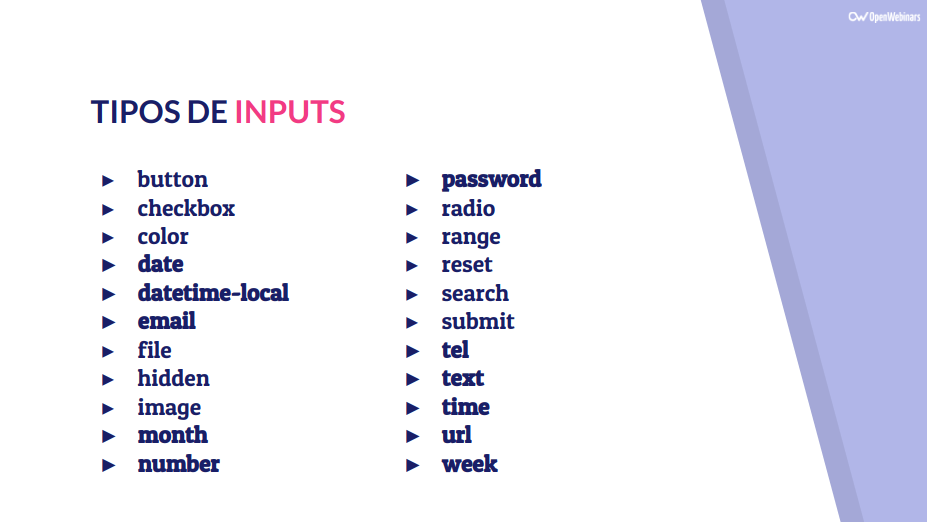

## Tipos de Input en los formularios

La lista de tipos (type) de Inputs que podemos tener es muy larga. La podemos ver en la siguiente imagen:



Muchos de ellos son nuevos en HTML5 por lo que es importante comprobar cómo se ven en los distintos navegadores o comprobarlo de manera previa usando la página HTML5 Test.

Tienen especial relevancia los siguientes:

- Radio Groups
- Checkboxes
- Datalist

### Radio Group

Es una agrupación de inputs que presenta opciones que queremos que sean excluyentes:

Un ejemplo sería:

```html
<label for="genero">Sexo</label>
<input type="radio" name="genero" value="masculino" />Hombre<br />
<input type="radio" name="genero" value="fememino" checked />Mujer<br />
```

Para que sean excluyentes deben de tener el mismo valor para el atributo **_name_** y el **_type="radio"_**

### CheckBoxes

Es una agrupación de opciones que presenta opciones de las cuáles podemos elegir una o varias.

Un ejemplo sería:

```html
    <label for="dispositivos">Dispositivos electrónicos</label><br />
    <input type="checkbox" name="dispositivos" value="pc" />PC<br />
    <input type="checkbox" name="dispositivos" value="table" />Tableta<br />
    <input type="checkbox" name="dispositivos" value="movil" />Móvil
```

Fijaros que para agruparlos deben de tener el mismo valor para **name** y el **_type="checkbox"_**

### Data Lista

Es una nueva forma en HTML5 de hacer una lista de valores posibles para un input.

Un ejemplo sería:

```html
    <input list="editor">

    <datalist id="editor">
        <option value="Atom">
        <option value="NotePad++">
        <option value="VsCode">
        <option value="Sublime">
        <option value="Brackets">
    </datalist>
```

Con el atributo **list** indicamos la lista de opciones que vamos a tener y en la etiqueta **<datalist>** metemos las **<option>** que queramos.

Es importante destacar que podríamos meter otras opciones en el Input pero al usar esta estructura se nos ayuda a rellenarlo y a elegir la opción correcta.
