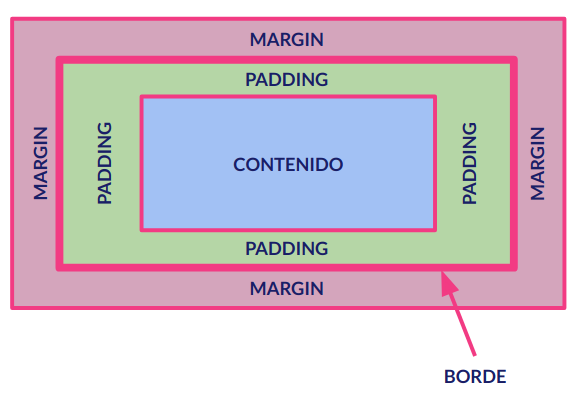
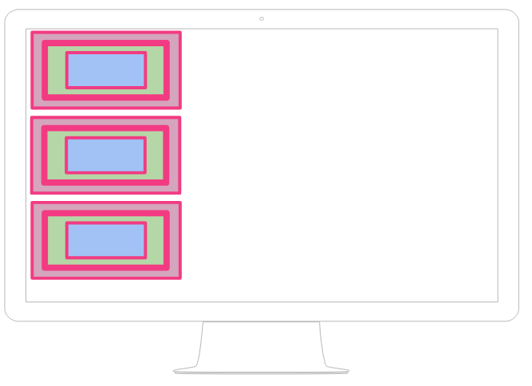
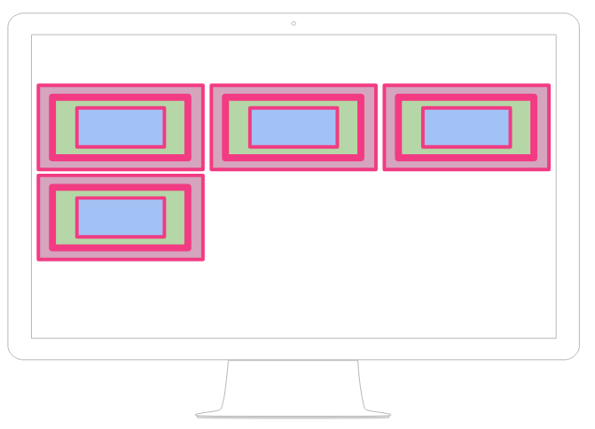

Una de los conceptos más importantes que debemos recordar a la hora de elaborar CSS es que todos y cada uno de los elementos de mi página web son cajas.

Eso exactamente, ¿ qué significa ?. Significa que todos los elementos que representan algo en HTML tiene la siguiente estructura visual:

Con ese modelo debemos por lo tanto distinguir la siguientes zonas:

- El **contenido** que es lo "importante", el texto en las etiquetas de texto, la imagen en las etiquetas de imagen etc..
- El **padding** que es la distancia que existe entre el contenido y el borde de la caja.
- El **borde** que es el elemento que marca la división entre el elemento y el resto de los elementos de la página.
- El **margen** que es la distancia entre el elemento y el resto de los elementos de la página.

Podemos comprobar estas propiedades, y el hecho de que por defecto los navegadores les dan valor, utilizando las herramientas para desarrolladores de los mismos.

### Comportamiento de las cajas

Además de conocer la estructura de las caja CSS debemos conocer cómo se comportan estas cajas cuando las representamos en nuestro navegador.

Aunque en cursos posteriores seremos más específicos, de manera general podemos distinguir entre elementos en bloque y el elementos en línea.

Los **elementos en bloque** son elementos que, independientemente de la anchura que tengan, se separan verticalmente de los elementos anteriores y posteriores. Es como si _"provocaran"_ un salto de línea antes y uno después (figuradamente hablando).

Representado esto gráficamente sería algo así:

En cambio, los **elemeno en línea** se van sucediendo a lo largo de la misma línea, mientras caben, uno detrás de otro y de izquierda a derecha (al menos en nuestro idioma). Cuando no caben pasan a la línea siguiente. Digamos que _"fluyen"_ dependiendo de la anchura de la pantalla de nuestro navegador. Este fluir es precisamente la clave a la hora de maquetar páginas web que es algo que veremos en otro curso.

Representado este comportamiento gráficamente sería algo así:

**NOTA:** Es muy importante saber qué tipo de elemento es cada etiqueta que usemos.
