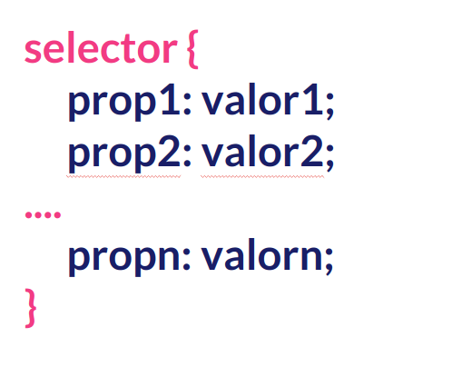

## Selectores CSS. Elementos en Cascada

Ya sabemos incluir estilos en nuestro HTML, ya sabemos que todos los elementos de nuestra página web son cajas y ahora vamos a dar el siguiente paso, seleccionar los elementos que queremos, de entre todos los que hay, para posteriormente darles estilos.

Para ello utilizaremos selectores CSS.

Los **selectores CSS** son **reglas** o **patrones** que nos van a permitir seleccionar los distintos elementos de mi página web para poder modificar sus propiedades o estilos.

Desde mi punto de vista dominar los selectores CSS es lo más importante. Un dominio correcto de los mismos te ahorrará trabajo.

Estos selectores es lo que vamos a incluir en nuestros archivos CSS y su síntaxis de manera general es la siguiente:



- **selector** hace referencia a la regla o patrón mediante cuya aplicación elegiremos uno o varios elementos de mi página web.
- **propX** son las propiedades que queremos modificar en los elementos seleccionados.
- **valorX** es el valor que daremos a cada una de las propiedades modificadas.

Todo con la síntaxis que tenemos expresada en la imagen.

### Algunos selectores

- **\*** es el selector universal. Selecciona todo los elementos.
- **\#id** selecciona el elemento que tenga ese valor (id en este ejemplo) en el atributo id.
- **\.class** selecciona los elementos que tengan ese valor (class en este ejemplo) en el atributo class.
- **etiqueta** selecciona esas etiquetas concretas.
- **selector1,selector2** sirve para cambiar las propiedades de los elementos seleccionados por ambos selectores
- **selector1 selector2** sirve para cambiar las propiedades de los elementos seleccionados por selector2 que se encuentran dentro de aquellos seleccionados por selector1.
- **selector1>selector2** sirve para cambiar las propiedades de los elementos seleccionados por selector2 que son hijos directos (en el árbol DOM) de aquellos que se seleccionen con selector1.
- **selector1+selector2** sirve para cambiar las propiedades de los elementos seleccionados por selector2 que están justo después de aquellos que se seleccionan mediante selector1.
- **selector1~selector2** igual que el anterior pero justo antes.
- **[atribut expre valor]** siendo expre (=,~=,|=,$=,\*..) para seleccionar elementos atendiendo al valor de sus atribtuos.

Un ejemplo de todos ellos podemos verlo en el siguiente HTML:

```css
* {
  font-family: "Courier New", Courier, monospace;
}

#main {
  background-color: grey;
}

h1.especial {
  color: blue;
}

h2,
h3 {
  border: 1px solid orange;
}

li {
  color: red;
}

li li {
  color: green;
}

p > img {
  border: 5px solid black;
}

img[alt="segunda"] {
  border: 5px solid red;
}

p ~ h3.antes {
  background-color: pink;
}
p + h3 {
  background-color: blue;
}
```

Además, pueden combinarse de todas las maneras que se nos ocurran para realizar selecciones más complejas.

### Hoja de estilos ¿en "Cascada"?

Ya desde la misma definición de CSS dijimos que la _C_ hacía referencia a "en Cascada". Pero exactamente, ¿qué significa eso?.

Básicamente dos cosas:

a) Los estilos se van **propagando** hacia abajo o lo que es lo mismo si especificamos una propiedades en un elemento padre los hijos tienen el mismo valor para esas propiedades.

b) Si hay más de una regla que se puede aplicar al mismo elemento y hay **conflicto**, entonces se aplica la **regla más específica**.
