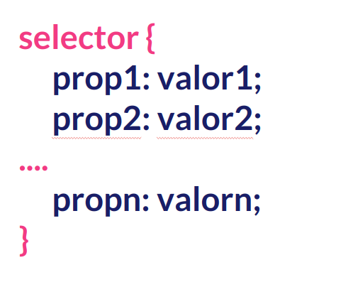

## Propiedades Interesantes

Ya sabemos incluir estilos, ya sabemos sobre cajas y ya sabemos cómo seleccionar los elementos de mi página web para poder aplicarles estilos.

Ahora, en este apartado, vamos a ver que propiedades podemos modificar, pero antes, vamos a recordar la síntaxis general de los archivos CSS:



Hay muchísimas propiedades que podemos modificar, algunas son comunes a todas las etiquetas y otros sólo se pueden modificar.

Podéis acceder a lista completa aquí:

[Propiedades CSS - Lista completa](https://developer.mozilla.org/es/docs/Web/CSS/Referencia_CSS)

Es casi imposible conocerla entera pero es una referencia que debemos de tener siempre presente en nuestra barra de favoritos.

Si queremos reducirla la lista a aquellas propiedades que son consideradas fundamentales o esenciales para poder empezar a aplicar estilos es mejor que nos fijemos en este enlace:

[Propiedades CSS básicas](https://developer.mozilla.org/es/docs/Web/CSS/CSS_Properties_Reference)

No obstante voy a reducir aún más la lista a una serie de propiedades referentes a los siguiente aspectos:

- **Color**
- **Fondos**
- **Dimensiones y Unidades**
- **Márgenes, Bordes y Padding**
- **Texto**

### Colores

Para establecer el **color del texto** de nuestra web lo podemos establecer usando la propiedad _color_. Por ejemplo:

```css
/* Notación mediante colores */
p {
  color: red;
}

/* Notación hexadecimal */
h1 {
  color: #cccccc;
}

/* Notación RGB */
h3 {
}
```

### Fondo

Usando CSS podemos también establecer el **fondo** de nuestros elementos. Hay diversas propiedades, las más detacadas:

- **background-color** para establecer el color de fondo.
- **background-image** para establecer una imagen de fondo.
- **background-repeat** para especificar cómo se repite la imagen de fondo. Puede tomar diversos valores.
- **background-origin** desde donde queremos que se repita la imagen.

Un ejemplo básico:

```css
body {
  background: grey;
}
```

### Dimensiones y unidades

Las dimensiones de los elementos de nuestra página se establecen usado las siguientes propiedades:

- **width** para la anchura de nuestro elemento.
- **height** para altura de nuestro elemento.

Y ambas podemos determinar usar varios tipos de unidades:

- **px:** En píxeles
- **%:** En relación a lo que ocupe el padre del elemento dentro del árbol DOM.
- **em:** En relación al tamaño por defecto de la letra del navegador en ese instante (normalmente 16px..)
- **rem:** En relación al tamaño por defecto de la letra que tiene la etiqueta HTML.

Un ejemplo básico:

```css
#first img {
  width: 50%;
}

#second {
  width: 600px;
  ...;
}
```

### Márgenes, Bordes y Paddings

Son propiedades para establecer las dimensiones de los elementos de la caja.

Para márgenes y paddings tenemos varias formas de hacerlo. Si tenemos en cuenta que A(Arriba)- D (Derecha) - AB (Abajo) - IZQ (Izquierda):

```css
selector {
  /* A -D -AB-IZQ */
  margin: 20px 50px 20px 50px;

  /* A y AB - DCHA e IZQDA */
  margin: 20px 50px;

  /* Todos */
  margin: 50px;

  /* O de manera individual */
  margin-left: 10px;
  margin-top: 10px;
  margin-bottom: 10px;
  margin-right: 10px;
}
```

Para el padding sería exactamente lo mismo. Sólo tenemos que sustituir _margin_ por _padding_.

En relación al borde de un elemento tenemos también varias posibilidad. De igual manera lo vamos a ilustrar mediante un ejemplo:

```css
/* De manera general*/
border: 1px solid black;

/* Sólo el borde */
border-color: black;

/*Sólo la anchura del borde */
border-width: 1px;

/* Sólo el estilo de la línea del borde */
/* posibles valores solid, dashed, dotted */
border-style: solid;
```

### Estilos para el texto

Hay multitud de propiedades para establecer los estilos del texto de mi página web. Algunas de las más destacables son:

```css
/* Para establecer el tipo de fuente */
font-family: "Times New Roman", TImes, serif;

/* Para establecer el tamaño de la fuente */
font-size: 2em;

/* Para establecer el grosor del tipo de letra */
/* Posibles valores: bold, bolder, lighter */
font-weight: bold;

/* Para establecer la alineación texto */
/* Posibles valores: center, left, right, justify */
text-align: center;

/* Para establecer la decoración de texto */
/* Posibles valores: underline, overline, none, line-through */
text-decoration: underline;

/* Para establecer tabulaciones */
text-indent: 10px;

/* Para transformar un texto todo a mayúscula o minúsculas */
/* Posibles valores: uppercase, lowercase, capitalize */
text-transform: uppercase;
```
