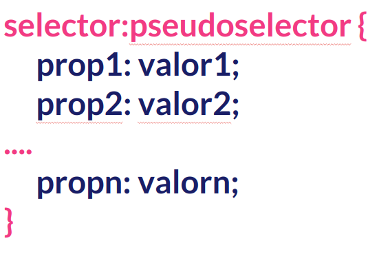
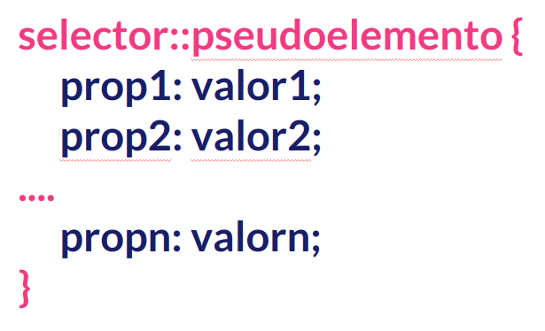

## PSEUDOSELECTORES Y PSEUDOELEMENTOS

Además de los selectores tradicionales que hemos presentado anteriormente CSS nos proporciona unos "selectores" especiales, los llamados **_pseudoselectores_** y los **_pseudoelementos_**.

Los **pseudoselectores** son palabras clave que se añaden a los selectores y que nos indican un **ESTADO** determinado de los elementos seleccionados.

Los **pseudoelementos** son palabras clave que se añaden a los selectores y que nos indican una **PARTE** de un elemento y nos permiten añadir contenido.

### Pseudoselectores

Tienen la siguiente síntaxis:

Y podemos dividirlos en los de estado y los de posición

#### De estado

- **:link**
- **:visited**
- **:enabled**
- **:disabled**
- **:checked**
- **:required**
- **:optional**
- **:focus**
- **:hover**
- **:empty**

#### De posición

- **:first-child**
- **:first**
- **:first-of-type**
- **:last**
- **:last-child**
- **:last-of-type**
- **:nth-child(n)**
- **:nth-last-of-type()**

### Pseudoelementos

Tienen la siguiente síntaxis:

Los más destacados son:

- **::first-line**
- **::first-letter**
- **::after**
- **::before**
- **::selected**
