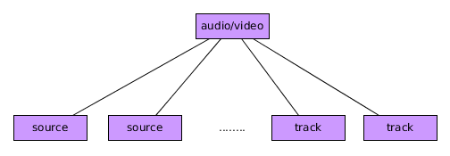

## Etiquetas Multimedia

Una de las novedades más esperadas en HTML5 es la aparición de etiquetas específicas para multimedia.

Las más importantes son las etiquetas **`<audio>`** y **`<video>`** y para representarlas vamos optar por usar, de manera general estructuras de árbol similares a la siguientes (hay otros árboles válidos pero este es más fácil y general):



- La etiqueta raíz será **`<audio>`** o **`<video>`** según lo que queramos mostrar en nuestra navegador.
- Dentro de esta etiqueta raíz tendremos tantas etiquetas **`<source>`** como formatos distintos de ese mismo elemento ofrezcamos. Es importante asegurarnos de que el formato del fichero multimedia es soportado por los navegadores. Si ofertamos varias fuentes el navegador decidirá cuál reproduce.
- Opcionalmente podremos añadir descripción de audio,subtítulos o similares usando una o varias etiquetas **`<track>`**.

Las etiquetas **`<audio>`** y **`<video>`** pueden tener los siguientes atributos.

- **controls** para mostrar los controles gráficos de reproducción (play, stop, pause, volumen).
- **autoplay** para que se empiece a reproducir al cargar la página de manera automática.
- **loop** si queremos que se reproduzca en bucle de manera infinita.
- **muted** si queremos que se reproduzca en silencio.

Adicionalmente la etiqueta **`<video>`** puede tener más atributos:

- **`width`** y **`height`** para indicar la anchura y altura del vídeo.
- **poster** para mostrar una imagen mientras el vídeo se carga.

### Etiqueta `<source>`

Tiene dos atributos fundamentales:

- **src** para indicar dónde está el fichero multimedia (una ruta).
- **type** para indicar el tipo de fichero, por ejemplo: `_type="audio/mp3"_ o _type="video/webm"_`.

### Etiqueta `<track>`

Tiene 5 atributos fundamentales:

- **src** para indicar dónde está el fichero de descripción (una ruta).
- **kind** para indicar si es subtítulo, descripción etc.. Tiene diversos valores que se pueden consultar en la documentación.
- **scrlang** que indica el código del idioma (es, en, fr...) de la descripción. El navegador elegirá uno u otro dependiendo de la configuración el usuario.
- **label** la etiqueta que describe el idioma (español, inglés etc..).
- **type** el tipo de fichero. Hay diversos aunque lo más normal es _type="text/vtt"_.

Un ejemplo de todo junto:

```html
<audio controls>
    <source src="multimedia_files/Frase_de_Neil_Armstrong.mp3" type="audio/mp3" />
    <source src="multimedia_files/Frase_de_Neil_Armstrong.ogg" type="audio/ogg" />
    Tu navegador no soporta esta etiqueta (audio)
    <!--Tu servidor web tiene que estar debidamente configurado-->
    <track src="multimedia_files/Frase_de_Neil_Armstrong_es.vtt" kind="subtitles" srclang="es" label="Español" type="text/vtt" />
    <track src="multimedia_files/Frase_de_Neil_Armstrong_en.vtt" kind="subtitles" srclang="en" label="English" type="text/vtt" />
</audio>

    <!-- Etiqueta de vídeo-->
<video width="320" height="240" controls>
    <source src="multimedia_files/Zeppelin_Explodes.webm" type="video/webm">
    Tu navegador no soporta esta etiqueta (video)
</video>
```
